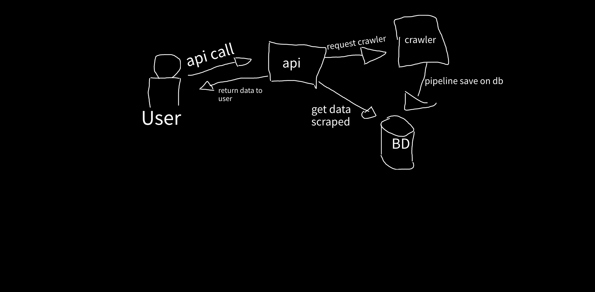

## DESAFIO
- O desafio é fazer uma API que busque dados de um processo em todos os graus dos Tribunais de Justiça de Alagoas (TJAL) e do Ceará (TJCE). Geralmente o processo começa no primeiro grau e pode subir para o segundo. Você deve buscar o processo em todos os graus e retornar suas informações.
- Será necessário desenvolver crawlers para coletar esses dados no tribunal e uma API para fazer input e buscar o resultado depois.

## Input
- Você deve criar uma API para receber um JSON contendo o número do processo. Para descobrir o tribunal você pode pedir no input ou usar o padrão CNJ de numeração de processos jurídicos.

## Output
- O cliente tem que ser capaz de pegar o dado quando o processamento termina, então você deve criar um mecanismo que permita isso, retornando sempre um JSON para os processos encontrados em todas as esferas.
- Crawlers / Tribunais onde os dados serão coletados
- Tanto o TJAL como o TJCE tem uma interface web para a consulta de processos. O endereço para essas consultas são:
    - TJAL
    - 1º grau - https://www2.tjal.jus.br/cpopg/open.do
    - 2º grau - https://www2.tjal.jus.br/cposg5/open.do
    - TJCE
    - 1º grau - https://esaj.tjce.jus.br/cpopg/open.do
    - 2º grau - https://esaj.tjce.jus.br/cposg5/open.do
    - 
## Dados a serem coletados:
•	classe
•	área
•	assunto
•	data de distribuição
•	juiz
•	valor da ação
•	partes do processo
•	lista das movimentações (data e movimento)

## Exemplos de processos
- 0070337-91.2008.8.06.0001 - TJCE - Até 2ª instância - Teste realizado com sucesso
- 0004017-94.2018.8.06.0167 - TJCE - Até 2ª instância - Teste realizado com sucesso
- 0710802-55.2018.8.02.0001 - TJAL - Até 2ª instância - Teste realizado com sucesso
- 0034520-06.2010.8.02.0001 - TJAL - Até 1ª instância - Teste realizado com sucesso
- 0010484-60.2011.8.02.0001 - TJAL - Até 1ª instância - Teste realizado com sucesso

## Alguns pontos que serão analisados:
-	Organização do código
-	Testes
-	Facilidade ao rodar o projeto
-	Escalabilidade: o quão fácil é escalar os crawlers.
-	Performance: aqui avaliamos o tempo para crawlear todo o processo jurídico
------------------------------------------------------------------------------------------------------------------------------
## Premissas: 
- O projeto já foi feito drop em produção e já foi mapeado todos os processos até então.
- Todos os demais tribunais possuem o mesmo mapeamento de campos, sendo assim uma única classe de crawler funcionará para todos, mudando apenas o link de acesso
- A máquina possui capacidade suficiente para todas as requisições feitas

### Como foi estruturado:

1. Comandos pra subir o projeto:

scrapyd
scrapyd-deploy default
python manage.py migrate
python manage.py runserver

2. Endpoints da API 

api
    
    URL: /api/
    Método: POST
    Descrição: Inicia um processo de crawler no site do tribunal escolhido para coletar informações sobre um processo até 2 grau.
    Parâmetros da Requisição:
        numero_processo (string, obrigatório): O número do processo a ser pesquisado.
        tribunal (string, obrigatório): O tribunal para coletar dados (pode ser 'tjal' ou 'tjce').

3. Formato de Requisições e Respostas:
- Formato de Requisição

    URL: /api/
    Método: POST
    Corpo da Requisição:
    json
    {
        "numero_processo": "string",
        "tribunal": "string"
    }

Formato de Resposta
    Resposta de Sucesso (200 OK):
    json

    [
    {
        "numero_processo": "string",
        "tribunal": "string",
        "area": "string",
        "classeProcesso": "string",
        "assunto": "string",
        "data_distribuicao": "string",
        "juiz": "string",
        "valor_acao": "string",
        "lista_partes_processo": [],
        "lista_movimentacoes": [],
        "grau": "string"
    }
    ]

Resposta de Erro (400 Bad Request):

    {
        "error": "string"
    }

4. Exemplos de Uso
Exemplo 1: Solicitar Informações sobre um processo

    Requisição:
    http
    
    POST /api/
    Content-Type: application/json
    
    {
        "numero_processo": "123456789",
        "tribunal": "tjal"
    }

Resposta (Sucesso):

    [
      {
        "area": "Cívil",
        "assunto": "Energia Elétrica",
        "classeProcesso": "Procedimento Comum",
        "data_distribuicao": "29/04/2010",
        "grau": "1 grau",
        "juiz": "Marcelo Guimarães de Aguiar",
        "lista_movimentacoes": {
          "01/04/2014": "Recebidos os autos",
          "01/06/2015": "Conclusos",
          "02/12/2015": "Visto em correi\u00e7\u00e3o| URL: https://www2.tjal.jus.br/cpopg/abrirDocumentoVinculadoMovimentacao.do?processo.codigo=01000BJE00000&cdDocumento=16036154&nmRecursoAcessado=Visto+em+correi%C3%A7%C3%A3o",
          "03/02/2011": "Decurso de Prazo",
          "03/09/2018": "Visto em correi\u00e7\u00e3o| URL: https://www2.tjal.jus.br/cpopg/abrirDocumentoVinculadoMovimentacao.do?processo.codigo=01000BJE00000&cdDocumento=25548520&nmRecursoAcessado=Visto+em+correi%C3%A7%C3%A3o",
          "05/01/2022": "Conclusos",
          "05/08/2011": "Mandado Expedido| URL: https://www2.tjal.jus.br#liberarAutoPorSenha",
          "05/09/2011": "Juntada de Peti\u00e7\u00e3o",
          "06/02/2012": "Certid\u00e3o",
          "06/04/2016": "Despacho de Mero Expediente| URL: https://www2.tjal.jus.br/cpopg/abrirDocumentoVinculadoMovimentacao.do?processo.codigo=01000BJE00000&cdDocumento=16778244&nmRecursoAcessado=Despacho+de+Mero+Expediente",
          "06/05/2013": "Juntada de Peti\u00e7\u00e3o",
          "06/06/2016": "Juntada de Peti\u00e7\u00e3o",
          "06/08/2021": "Visto em Correi\u00e7\u00e3o - CGJ| URL: https://www2.tjal.jus.br/cpopg/abrirDocumentoVinculadoMovimentacao.do?processo.codigo=01000BJE00000&cdDocumento=39288180&nmRecursoAcessado=Visto+em+Correi%C3%A7%C3%A3o+-+CGJ",
          "07/04/2016": "Audi\u00eancia Designada",
          "08/02/2012": "Despacho de Mero Expediente| URL: https://www2.tjal.jus.br/cpopg/abrirDocumentoVinculadoMovimentacao.do?processo.codigo=01000BJE00000&cdDocumento=7010594&nmRecursoAcessado=Despacho+de+Mero+Expediente",
          "08/04/2016": "Disponibiliza\u00e7\u00e3o no Di\u00e1rio da Justi\u00e7a Eletr\u00f4nico",
          "09/11/2011": "Ato ordinat\u00f3rio praticado| URL: https://www2.tjal.jus.br#liberarAutoPorSenha",
          "11/03/2013": "Despacho de Mero Expediente| URL: https://www2.tjal.jus.br/cpopg/abrirDocumentoVinculadoMovimentacao.do?processo.codigo=01000BJE00000&cdDocumento=9344053&nmRecursoAcessado=Despacho+de+Mero+Expediente",
          ...
    },
        "lista_partes_processo": {
          "Autor": [
            "Maia Hamburgueria e Choperia Ltda - ME",
            "Advogado:",
            "Vagner Paes Cavalcanti Filho",
            "Advogado:",
            "Gustavo Ten\u00f3rio Accioly",
            "Representa:",
            "Francisco Edilson Maia da Costa"
          ],
          "Réu": [
            "Companhia Energ\u00e9tica de Alagoas - CEAL",
            "Advogado:",
            "Danielle Ten\u00f3rio Toledo Cavalcante"
          ]
        },
        "numero_processo": "0034520-06.2010.8.02.0001",
        "tribunal": "tjal",
        "valor_acao": "R$510,00"
      }
    ]

Resposta (Erro):
json para número do processo inválido

    {
        "error": "Número do processo inválido!"
    }

Json para tribunal não suportado pela API
    
    {
        "error": "Api não possui suporte para esse tribunal"
    }

5. Estrutura do Projeto

O projeto está estruturado da seguinte forma:

    API: 
      Aplicação Django criando uma api com djangorestframework
      Rota /api/: Definição da rota principal para iniciar solicitações de raspagem.
    Crawlers:
      Crawler único para os dois tribunais devido a premissa de que todos os tribunais terão o mesmo modelo de campos
      Crawler disponível em crawler/crawler/spiders/courts_crawler.py
    Scrapyd:
      Scrapyd é usado como um job para isolar o crawler devido a sua indepedência do ciclo de vida.
      Também é pensado para que possa ser ativado diversos crawlers, sendo independetes, possuem alta escalabilidade
    Banco de dados:
      O banco de dados utilizado foi o PostgreSQL devido sua estabilidade e rápido tempo de resposta, extremamente necessário para o contexto do projeto
      Outra possibilidade seria a utilização de bancos NO-SQL como MongoDB devido a imprevisibilidade dos dados vindos do crawler. Entretanto em compração com tempo de resposta, o PostgreSQL ganha na performance com Indexing. "strategies include B-tree, multicolumn, expressions, and partial, as well as advanced indexing techniques such as GiST, SP-Gist, KNN Gist, GIN, BRIN, covering indexes, and bloom filters."
Pra mais especificações dos crawlers visite: https://docs.scrapy.org/en/latest/topics/architecture.html

### Como subir e testar a aplicação
- Dentro da pasta courts, aonde está o docker-compose.yml utilize o comando "docker-compose up" para inicializar os três containers
- O container "web" responsável pela API está configurado para aceitar 127.0.0.1 na porta 9000, como http://127.0.0.1:9000/. Para utilizar os endpoints vá para o tópico 2
- Observe que no serviço do crawler já faz deploy do crawler pelo script e subida do scrapyd
- Para ter certeza que o scrapyd está de pé, verifique o http://127.0.0.1:6800/
## Arquitetura ideal: (Ideia implementada nessa versão)
- O ideal seria a implementação da API e dos crawlers isoladamente em orquertradores scrapyd. 
- Fazendo com que a API ativasse o crawler no container scrapyd, ao finalizar o crwaler o pipeline faria inserção no BD e um listener na API aguardaria a finalização e buscasse o dado no BD
- Com isso o crawler fica isolado, o job é respnsável por ele e existe uma enorme facilidade de escalabilidade do projeto

## Limitações:
- Caso ocorra um erro ao executar o crawler, ele retorna um status OK com [] ao invés de 500
- Ao pesquisar um processo, se não existir ele ainda tenta fazer um crawl

## Observações e melhorias:
- Utilizar um bucket S3 para armazenar os dados do crawler ao invés do BD dentro do docker
- Fazer um schedule no GCP para rodar um script que faça um crawler salvar os processos do dia na tabela
- Para escalabilidade penso na criação de vários módulos da api, implementada junto com um LoadBalancer. Onde cada módulo poderá realizar a inicialização de diversos crawlers sem atrapalharem outros
- Pode-se também dependendo do dado e da necessidade, utilizar diferentes BD para cada módulo.
